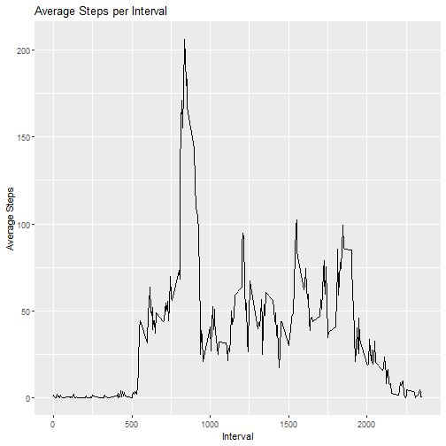

## Loading and preprocessing the data

```r
unzip("activity.zip")
my_data<-read.csv("activity.csv")
```


```r
my_data <- my_data %>% 
  mutate(date = as.Date(date,"%Y-%m-%d",na.rm=TRUE))
```


## What is mean total number of steps taken per day?

```r
ggplot(my_data %>% 
          group_by(date) %>% 
          summarise(TotSteps = sum(steps,na.rm = TRUE)))+
  geom_histogram(aes(x=TotSteps/1000,fill=TotSteps),binwidth = 1, col="black", center=0.5)+
  labs(x="Total Steps (in thousands)",y="Number of Days",title="Histogram: Total Steps per Day")+
  scale_y_continuous(breaks=seq(1,11))+
  scale_x_continuous(breaks = seq(0,21))+
  theme(panel.grid.major.y = element_line(color = "black"),
        panel.grid.minor = element_blank(),
        panel.grid.major.x = element_blank())
```


```r
my_data %>% 
  group_by(date) %>% 
  summarise(TotSteps = sum(steps,na.rm = TRUE)) %>%
  summarise_at(.vars = "TotSteps", .funs = c(mean,median)) %>%
  rename("Mean"=fn1,
         "Median"=fn2) %>%
  kbl() %>%
  kable_styling()
```

<table class="table" style="margin-left: auto; margin-right: auto;">
 <thead>
  <tr>
   <th style="text-align:right;"> Mean </th>
   <th style="text-align:right;"> Median </th>
  </tr>
 </thead>
<tbody>
  <tr>
   <td style="text-align:right;"> 9354.23 </td>
   <td style="text-align:right;"> 10395 </td>
  </tr>
</tbody>
</table>

## What is the average daily activity pattern?

```r
ggplot(my_data %>%
         group_by(interval) %>%
         summarise(AvSteps = mean(steps,na.rm=TRUE)))+
  geom_line(aes(x=interval,y=AvSteps))+
  labs(x="Interval", y="Average Steps", title="Average Steps per Interval")
```




```r
my_data %>%
  group_by(interval) %>%
  summarise(AvSteps = mean(steps,na.rm=TRUE)) %>%
  arrange(-AvSteps) %>%
  head(.,1) %>%
  rename("Interval"=interval, "Average Steps"=AvSteps) %>%
  kbl() %>%
  kable_styling()
```

<table class="table" style="margin-left: auto; margin-right: auto;">
 <thead>
  <tr>
   <th style="text-align:right;"> Interval </th>
   <th style="text-align:right;"> Average Steps </th>
  </tr>
 </thead>
<tbody>
  <tr>
   <td style="text-align:right;"> 835 </td>
   <td style="text-align:right;"> 206.1698 </td>
  </tr>
</tbody>
</table>


## Imputing missing values

```r
summary(my_data) %>%
  kbl() %>%
  kable_styling()
```

<table class="table" style="margin-left: auto; margin-right: auto;">
 <thead>
  <tr>
   <th style="text-align:left;">   </th>
   <th style="text-align:left;">     steps </th>
   <th style="text-align:left;">      date </th>
   <th style="text-align:left;">    interval </th>
  </tr>
 </thead>
<tbody>
  <tr>
   <td style="text-align:left;">  </td>
   <td style="text-align:left;"> Min.   :  0.00 </td>
   <td style="text-align:left;"> Min.   :2012-10-01 </td>
   <td style="text-align:left;"> Min.   :   0.0 </td>
  </tr>
  <tr>
   <td style="text-align:left;">  </td>
   <td style="text-align:left;"> 1st Qu.:  0.00 </td>
   <td style="text-align:left;"> 1st Qu.:2012-10-16 </td>
   <td style="text-align:left;"> 1st Qu.: 588.8 </td>
  </tr>
  <tr>
   <td style="text-align:left;">  </td>
   <td style="text-align:left;"> Median :  0.00 </td>
   <td style="text-align:left;"> Median :2012-10-31 </td>
   <td style="text-align:left;"> Median :1177.5 </td>
  </tr>
  <tr>
   <td style="text-align:left;">  </td>
   <td style="text-align:left;"> Mean   : 37.38 </td>
   <td style="text-align:left;"> Mean   :2012-10-31 </td>
   <td style="text-align:left;"> Mean   :1177.5 </td>
  </tr>
  <tr>
   <td style="text-align:left;">  </td>
   <td style="text-align:left;"> 3rd Qu.: 12.00 </td>
   <td style="text-align:left;"> 3rd Qu.:2012-11-15 </td>
   <td style="text-align:left;"> 3rd Qu.:1766.2 </td>
  </tr>
  <tr>
   <td style="text-align:left;">  </td>
   <td style="text-align:left;"> Max.   :806.00 </td>
   <td style="text-align:left;"> Max.   :2012-11-30 </td>
   <td style="text-align:left;"> Max.   :2355.0 </td>
  </tr>
  <tr>
   <td style="text-align:left;">  </td>
   <td style="text-align:left;"> NA's   :2304 </td>
   <td style="text-align:left;"> NA </td>
   <td style="text-align:left;"> NA </td>
  </tr>
</tbody>
</table>


```r
new_data <- my_data %>%
  filter(is.na(steps)) %>% 
  left_join(.,my_data %>%
              group_by(interval) %>%
              summarise(Avsteps=mean(steps,na.rm=TRUE)),
            by="interval") %>%
  select(Avsteps,date,interval) %>%
  rename("steps"=Avsteps) %>%
  rbind(my_data %>%
          filter(!is.na(steps)),.)
```


```r
ggplot(new_data %>% 
          group_by(date) %>% 
          summarise(TotSteps = sum(steps,na.rm = TRUE)))+
  geom_histogram(aes(x=TotSteps/1000, fill=TotSteps),
                 binwidth = 1, col="black", center=0.5)+
  labs(x="Total Steps (in thousands)", 
       y="Number of Days",
       title="Histogram: Total Steps per Day")+
  scale_y_continuous(breaks=seq(1,18))+
  scale_x_continuous(breaks = seq(0,21))+
  theme(panel.grid.major.y = element_line(color = "black"),
        panel.grid.minor = element_blank(),
        panel.grid.major.x = element_blank())
```


```r
new_data %>% 
  group_by(date) %>% 
  summarise(TotSteps = sum(steps,na.rm = TRUE)) %>%
  summarise_at(.vars = "TotSteps", .funs = c(mean,median)) %>%
  rename("Mean"=fn1,
         "Median"=fn2) %>%
  kbl() %>%
  kable_styling()
```

<table class="table" style="margin-left: auto; margin-right: auto;">
 <thead>
  <tr>
   <th style="text-align:right;"> Mean </th>
   <th style="text-align:right;"> Median </th>
  </tr>
 </thead>
<tbody>
  <tr>
   <td style="text-align:right;"> 10766.19 </td>
   <td style="text-align:right;"> 10766.19 </td>
  </tr>
</tbody>
</table>

It does have an impact now there are 18 days between 10 and 11 thousand steps, when before there were only 10. And now the median is equal to the mean.


## Are there differences in activity patterns between weekdays and weekends?


```r
week_data <- new_data %>%
  mutate(day = if_else(weekdays(date) %in% c("Saturday", "Sunday"),"Weekend","Weekday"))
```


```r
ggplot(week_data %>% 
         group_by(day,interval) %>%
         summarise(Avstep = mean(steps)))+
  geom_line(aes(x=interval, y=Avstep))+
  facet_grid(.~day)+
  labs(x="Interval",
       y="Average Steps",
       title = "Weekend vs Weekday Average Steps per Interval")
```


